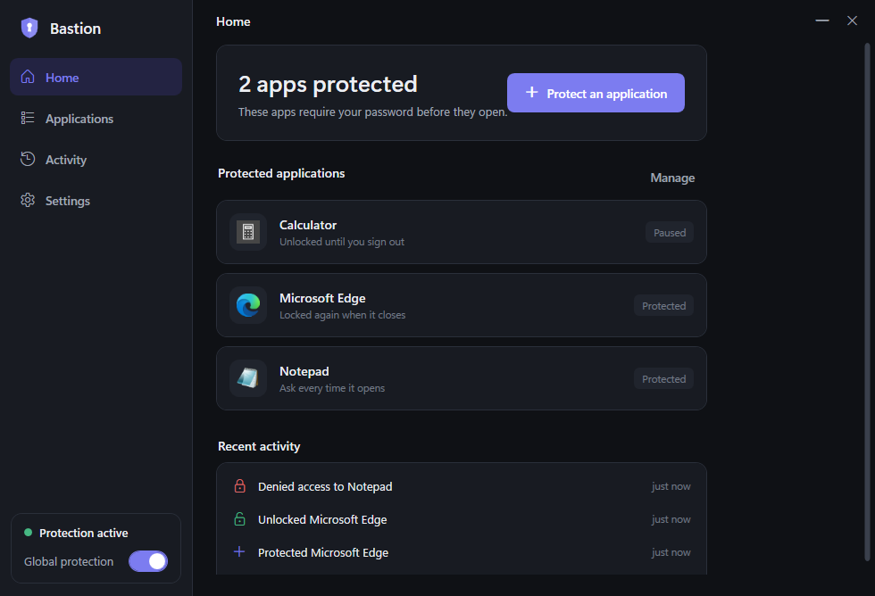
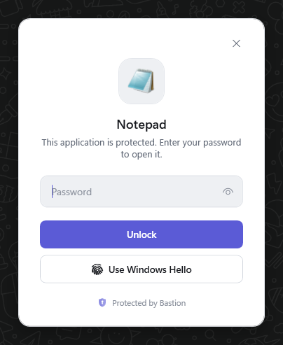
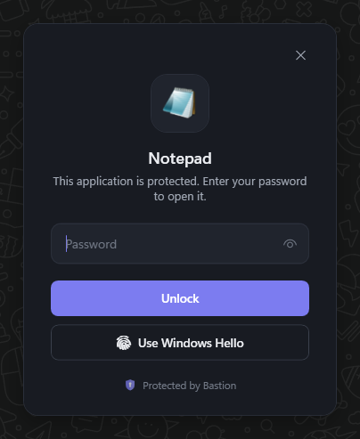
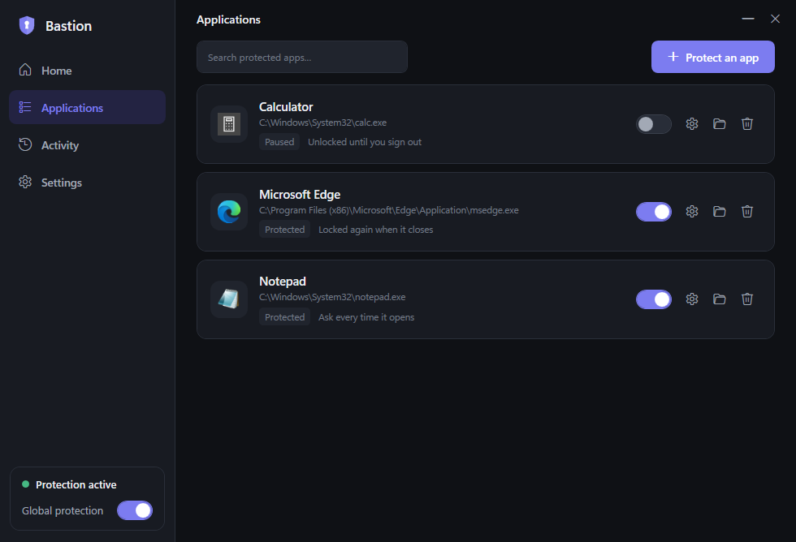
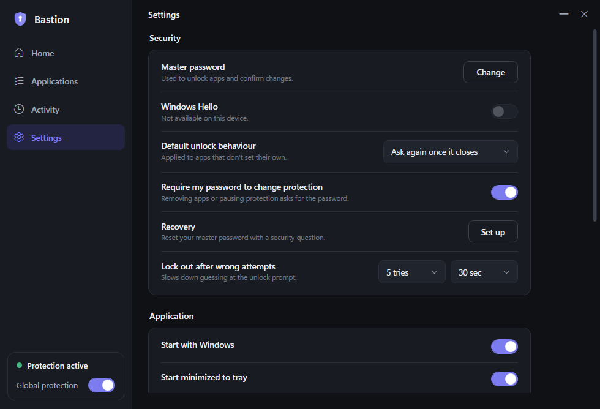

<div align="center">


# Bastion — Application Lock for Windows

**Requer a sua autenticação antes que um aplicativo escolhido possa abrir.**
Intercepta *todas* as formas de abrir o app (área de trabalho, Menu Iniciar, barra de tarefas, atalhos, associações de arquivo, protocolos, execução direta e processos filhos) usando um mecanismo garantido pelo próprio Windows — não é senha em atalho.

Prioridades: **segurança → confiabilidade → velocidade → experiência → design.**

</div>

---

<div align="center">

</div>

<table>
<tr>
<td width="50%"></td>
<td width="50%"></td>
</tr>
<tr>
<td></td>
<td></td>
</tr>
</table>

---

## O que é (e o que não é)

Bastion é um *application lock* real em modo usuário. Protege contra acesso do dia a dia por outras pessoas no PC, e é **honesto quanto aos limites**: um administrador da máquina sempre pode removê-lo (só um driver de kernel assinado mudaria isso), a proteção é casada pelo *nome* do executável, e se o serviço de proteção estiver parado os apps protegidos **permanecem bloqueados** (falha fechado). Apps da Microsoft Store (MSIX) não são interceptados de forma confiável — o fluxo de proteção avisa quando você escolhe um.

## Arquitetura (resumo)

| Projeto | Tipo | Executa como | Responsabilidade |
|---|---|---|---|
| `Bastion.Core` | lib | — | Modelos, cripto **Argon2id**, armazenamento, contrato IPC |
| `Bastion.Service` | Serviço Windows | LocalSystem | Hooks **IFEO**, autoridade de lançamento, *grants*, re-bloqueio |
| `Bastion.Gatekeeper` | WPF exe | usuário | A janela de autenticação que o SO abre no lugar do app |
| `Bastion.Ui` | WPF lib | — | Design system, Windows Hello, ícones, i18n |
| `Bastion.App` | WPF exe | usuário | Painel: onboarding, home, gerenciamento, configurações, bandeja |

Detalhes e o modelo de segurança em **[docs/ARCHITECTURE.md](docs/ARCHITECTURE.md)**.

## Compilar

```bash
dotnet build Bastion.sln -c Release
dotnet test tests/Bastion.Tests/Bastion.Tests.csproj
```

## Gerar o instalador

```powershell
powershell -ExecutionPolicy Bypass -File tools\publish.ps1   # -> dist\app
iscc installer\Bastion.iss                                   # Inno Setup 6 -> dist\BastionSetup-1.0.1.exe
```

O instalador é autossuficiente (runtime .NET 8 incluído): não precisa instalar nada antes na máquina de destino.

## Idiomas

Português (Brasil) e Inglês, com troca ao vivo nas Configurações e aplicados ao gatekeeper.

## Verificação

- 21 testes automatizados (cripto, persistência/corrupção de config, IPC, denylist, cooldown).
- Interceptação ponta-a-ponta verificada no Windows 11 com o serviço SYSTEM instalado: proteger → interceptar → autenticar → abrir → re-bloquear ao fechar → negar senha errada → desinstalar remove todos os hooks. Ver [docs/ARCHITECTURE.md](docs/ARCHITECTURE.md#verification-status).

---

<div align="center"><sub>Licença: veja <a href="docs/LICENSE.txt">docs/LICENSE.txt</a> (template de EULA proprietária, para substituir antes da distribuição).</sub></div>
